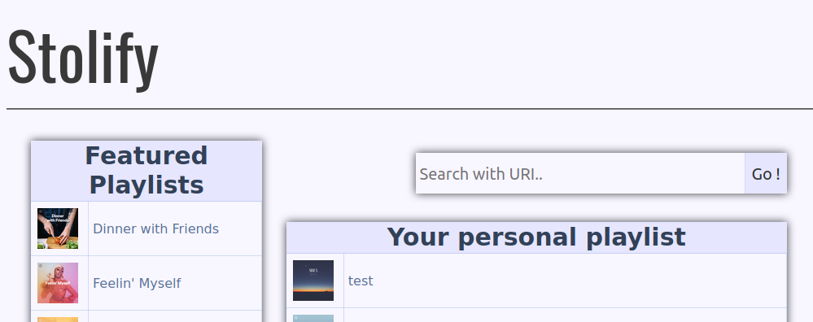

# Stolify
Stolify is a free and open source Flask App to download Spotify's playlist trough Youtube.


Stolify Home Page

## Disclaimer
This application is based on youtube-dl, is it legal to use youtube-dl? It's a grey area that I will not
discuss here. However you can find more informations here:  

* [Is it legal to use youtube-dl?](https://www.reddit.com/r/youtubedl/comments/k4rq23/is_it_legal_to_use_youtubedl/)

* [American Laws](https://www.eff.org/deeplinks/2020/11/github-youtube-dl-takedown-isnt-just-problem-american-law)

* [Does youtube-dl face any legal issues?](https://www.quora.com/Does-youtube-dl-face-any-legal-issues?share=1)

## Know bugs / Issues
*   There is a issue for wrapping youtube. It leads the app to not find any music on youtube.
*   The code may be improved a lot, I coded it 1 year ago to learn Flask.
*   Too much packages in requirements.txt, I must clean this mess.

## Quick start

```bash
git clone https://github.com/Ermite28/Stolify.git
cd Stolify

# Create and activate virtual environment
python3 -m venv venv
source venv/bin/activate

#Install requirements
pip3 install -r requirements.txt 
```
Now set up your Spotify by making a file .env `touch .env`. Edit it like it:
```bash

SPOTIPY_CLIENT_ID= Your Client ID
SPOTIPY_CLIENT_SECRET= your Client Secret
```
Congratulation ! 

You can now launch Stolify with this command:

```bash
flask run
```
You are now redirected to Spotify, Log in and copy paste the url you were redirected (My Github). 

You can now enjoy Stolify on localhost:
http://127.0.0.1:5000/


## FAQ

*No informations from youtube ?*

Update your youtube_dl version, this is appening very often. 
In your venv : `pip3 youtube_dl -U`

----------

*Flask not found*

Be sure to launch your venv
```bash
cd <path to your flask application>
source venv/bin/activate
```
